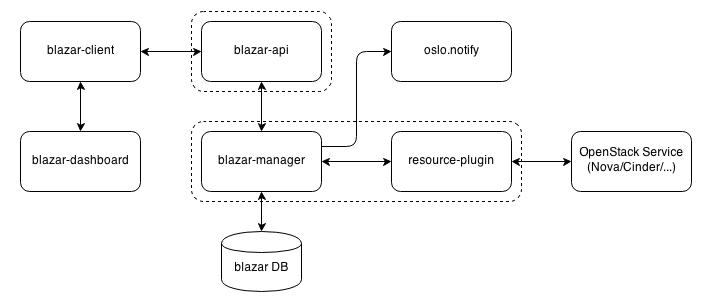

====================
Blazar architecture
====================

Blazar's architecture is described by the following diagram:

**blazar-client** - provides a Python implementation of communication with
Blazar API (``blazar-api`` service). It works as a library, a standalone
``blazar`` CLI client, as well as a plugin of the ``openstack`` client.

**blazar-api** - waits for REST API calls from the outside world to redirect
them to the manager. ``blazar-api`` communicates with ``blazar-manager``
via RPC.

**blazar-manager** - implements all logic and operations with leases,
reservations and events. Communicates with Blazar DB and stores there data
on leases, reservations and events.
``blazar-manager`` service is responsible for handling events created for
leases and running all relevant actions. ``blazar-manager`` uses
resource-plugins to work with other services' resources.

**resource-plugin** - responsible for exact actions to apply to other services'
resources. All resource plugins reside in the same process as
``blazar-manager``.

Nova resource reservation
+++++++++++++++++++++++++

Blazar's integration with Nova is based on the following components working
in tandem:

* Nova

  * Nova host aggregates are used to control which hosts have their access
    managed by Blazar.
    The canonical name for the Blazar-owned host aggregate is ``freepool``.

  * Nova flavors are used for instance reservations.

* Blazar-Nova

  * The ``blazar-nova`` package offers the ``BlazarFilter`` filter for
    nova-scheduler. ``BlazarFilter`` ensures that Nova does not schedule
    regular (non-reservation-belonging) instances on Blazar-owned hosts
    (unless preemption is enabled) and that host lease boundaries are respected.

* Placement

  * Nested resource providers are used to control which hosts are managed by
    Blazar.

  * Reservation classes are created and nested resource providers' inventories
    are updated for instance reservations.

It is worth noting that Blazar integrations are one-way, i.e. the other services
never call Blazar. Even the ``BlazarFilter`` operates in such a way that all
required data is present in Nova and Placement.

.. note::

  Only the compute host reservation is compatible with preemptible instances
  at the moment.

Compute host reservation
------------------------

Compute host reservation is analogous to a dedicated virtualisation host
offering. The user asks for a certain number of hosts with specified
characteristics, such as:

* the region,
* the availability zone,
* the host capabilities extra specs,
* the number of CPU cores,
* the amount of available RAM,
* the amount of available disk space.

Matching hosts are reserved for the sole use in the user's project.
Other projects will not share the same hosts during the lease period.

Virtual instance reservation
----------------------------

Virtual instance reservation offers a more granular compute resource reservation
that does not book entire hypervisors but instead allows using Blazar-owned
hosts via special time-limited flavors set up by Blazar. The user asks for
a certain number of instances with specific flavor characteristics,
such as:

* the number of provided CPU cores,
* the amount of provided RAM,
* the amount of provided disk space,
* affinity rule.

When the lease is active, a dedicated flavor is presented to the leasee.
No other project may use this flavor. Blazar ensures, albeit in a best-effort
manner, that supporting compute resources are reserved, e.g., it will not allow
for oversubscribing with multiple reservation types (hosts supporting the
virtual instance reservation cannot also be targeted for compute host
reservation at the same time).

Neutron resource reservation
++++++++++++++++++++++++++++

Apart from compute resources of Nova, Blazar allows to reserve certain Neutron
resources. At the moment, these are only floating IPs.

The Neutron integration thus far does not require changes to the Neutron
environment. The Blazar interaction looks to Neutron like any other service
client interaction.

Floating IPs reservation
------------------------

Blazar admin may register floating IPs with Blazar which can then later be
leased to end users. End users request floating IPs from a chosen network
and they will be created in user's project once the lease starts.
The allowed floating IPs *must not* exist in subnet's allocation pools.
Blazar will validate this *only once* when admin registers the floating IP
with Blazar. The integration *will break* if admin then adds the same floating
IP to the allocation pool as Blazar will try to own it and fail.
