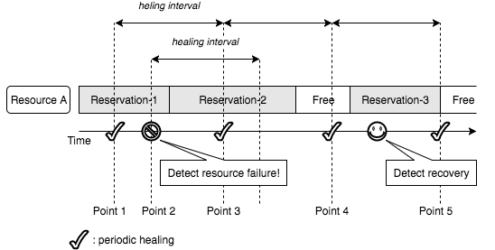

===================
Resource Monitoring
===================

Blazar monitors states of resources and heals reservations which are expected
to suffer from resource failure.
Resource specific functionality, e.g., calling Nova APIs, is provided as a
monitoring plugin.
The following sections describe the resource monitoring feature in detail.

Monitoring Type
===============

Blazar supports 2 types of monitoring - push-based and polling-based.

1. Push-based monitoring

   The monitor listens to notification messages sent by other components,
   e.g., sent by Nova for the host monitoring plugin.
   And it picks up messages which refer to the resources managed by Blazar.
   Event types, topics to subscribe and notification callbacks are provided by
   monitoring plugins.

2. Polling-based monitoring

   The blazar-manager periodically calls a states check method of monitoring
   plugins. Then, the monitoring plugins check states of resources, e.g.,
   *List Hypervisors* of the Compute API is used for the host monitoring
   plugin.

Admins can enable/disable these monitoring by setting configuration options.

Healing
=======

When the monitor detects a resource failure, it heals reservations which
are expected to suffer from the failure. Note that it does not immediately
heal all of reservations for the failed resource because the resource is
expected to recover sometime in the future, i.e., the monitor heals only
reservations which are active or will start soon.

In addition, the monitor periodically checks validity of reservations and
heals invalid reservations.
Therefore, even though the failed resource did not recover in the last
interval, the periodic task heals invalid reservations which will start in the
next interval.

The healing flow is as follows:

1. Resource A is reserved for the *Reservation-1*, *Reservation-2* and
   *Reservation-3* as shown in the following diagram.

2. At the point 1, the periodic task in the manager checks if there is any
   reservation to heal and it detects there is not.

3. At the point 2, the manager detects a failure of the resource A. Then, it
   heals active reservations and reservations which will start in the
   *healing interval*. In this case, *Reservation-1* and *Reservation-2* are
   healed immediately.

4. At the point 3, the periodic task checks if there is any reservation to
   heal. In this case, the task finds out there is no reservation to heal
   because the resource has not yet recovered but no reservation will
   start in next interval. *Reservation-2* has been already healed in step 3.

5. At the point 4, the periodic task checks if there is any reservation to
   heal again.
   In this case, the task finds out *Reservation-3* needs to be healed because
   it will start in the next interval and the resource has not yet recovered.

6. Before the point 5, the manager detects a recovery of the resource.

7. At the point 5, the periodic task finds out there is no failed resource and
   nothing to do.

Flags
=====

Leases and reservations have flags that indicate states of reserved
resources. Reservations have the following two flags:

* **missing_resources**: If any resource allocated to the reservation fails
  and no alternative resource found, this flag is set *True*.

* **resources_changed**: If any resource allocated to the *active* reservation
  and alternative resource is reallocated, this flag is set *True*.

Leases have the following flag:

* **degraded**: If the **missing_resources** or the **resources_changed** flags
  of any reservation included in the lease is *True*, then it is *True*.

Lease owners can see health of the lease and reservations included in the
lease by checking these flags.

Monitoring Resources
====================

Resource specific functionality is provided as a monitoring plugin.
The following resource is currently supported.

.. toctree::
   :maxdepth: 1

   compute-host-monitor.rst

