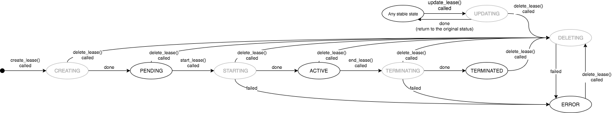
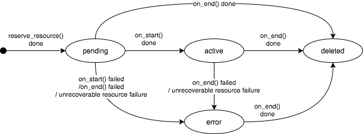
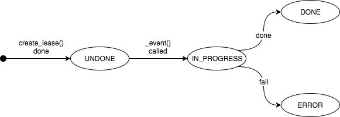

==============
State machines
==============

Blazar objects (leases, reservations, and events) each have a status. This
document describes statuses in detail.

Lease status
============

Lease statuses are categorized into two types: stable or transitional.
In the state machine shown below, stable statuses are drawn as black nodes
while transitional statuses are drawn as gray nodes. Status transitions are
triggered by an API call or an event in a lease.

A lease has the following four stable statuses:

* **PENDING**: A lease has been successfully created and is ready to start.
  The lease stays in this status until it starts.

* **ACTIVE**: A lease has been started and is active.

* **TERMINATED**: A lease has been successfully terminated.

* **ERROR**: Unrecoverable failures happened to the lease.

Transitional statuses are as follows:

* **CREATING**: A lease is being created.

* **STARTING**: A lease is being started.

* **UPDATING**: A lease is being updated.

* **TERMINATING**: A lease is being terminated.

* **DELETING**: A lease is being deleted. Any status can change to this status
  because delete is the highest prioritized operation. e.g. when a lease hangs
  up in the STARTING status, delete should be allowed.

If some action can cause an invalid status transition, the action is denied.
E.g. If a user sends an Update Lease request while it is starting, the Update
Lease request is denied because the transition from **STARTING** to
**UPDATING** is invalid.

Reservation status
==================

A reservation has the following four statuses. Lowercase letters are used for
backward compatibility:

* **pending**: A reservation has been successfully created and is ready to
  start. The reservation stays in this status until it starts.

* **active**: A reservation has been started and is active.

* **deleted**: Reserved resources have been successfully released.

* **error**: Unrecoverable failures happened to resources.

Event status
============

Event statuses are as follows.

Relationships between statuses
==============================

The following table shows conditions of statuses of reservations and events
that have to be satisfied for each lease status.

+-------------+-------------------+--------------------------+
| Lease       | Reservations      | Events                   |
+=============+===================+==========================+
| CREATING    | pending           | start_lease: UNDONE      |
|             |                   | , end_lease: UNDONE      |
+-------------+-------------------+--------------------------+
| PENDING     | pending           | start_lease: UNDONE      |
|             |                   | , end_lease: UNDONE      |
+-------------+-------------------+--------------------------+
| STARTING    | pending or active | start_lease: IN_PROGRESS |
|             | or error          | , end_lease: UNDONE      |
+-------------+-------------------+--------------------------+
| ACTIVE      | active            | start_lease: DONE        |
|             |                   | , end_lease: UNDONE      |
+-------------+-------------------+--------------------------+
| TERMINATING | active or deleted | start_lease: DONE        |
|             | or error          | , end_lease: IN_PROGRESS |
+-------------+-------------------+--------------------------+
| TERMINATED  | deleted           | start_lease: DONE        |
|             |                   | , end_lease: DONE        |
+-------------+-------------------+--------------------------+
| DELETING    | Any status        | Any status               |
+-------------+-------------------+--------------------------+
| UPDATING    | Any status        | Any status other than    |
|             |                   | IN_PROGRESS              |
+-------------+-------------------+--------------------------+

blazar/status module
====================

The *blazar/status* module defines and manages these statuses.
